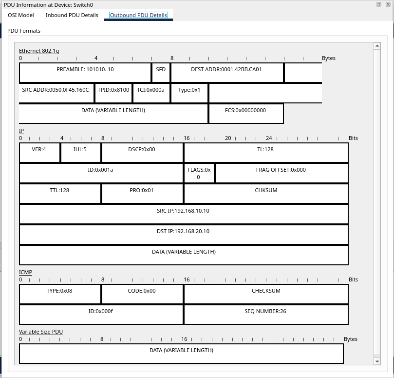

# Pre-Deployment Validation of VLAN Inter-Routing Architecture

This repository contains the source files and technical documentation for the **State House Presidential Villa 24 PMF Prescort** network staging project. The goal of this project was to architect and validate a **Router-on-a-Stick (RoAS)** topology to ensure secure inter-VLAN communication before physical deployment.

**Repository Description**: A comprehensive network staging project validating a Router-on-a-Stick (RoAS) architecture with 802.1Q trunking and inter-VLAN routing for State House Presidential Villa 24 PMF Prescort.

---

## Key Features

*   **Network Segmentation**: Logical separation of departments using **VLAN 10** and **VLAN 20**.
*   **Inter-VLAN Routing**: Implementation of **802.1Q encapsulation** on logical subinterfaces.
*   **Service Integration**: A functional web server subnet to validate end-to-end Application Layer delivery.
*   **Deep Packet Inspection**: Verified 802.1Q tagging through PDU simulation analysis.

---

## Physical Topology
The staging environment consists of a 2911 Router connected to a 2960 Switch via a Gigabit link. Two endpoint PCs are assigned to distinct VLANs (VLAN 10 and VLAN 20) to mirror a departmental structure in a virtualized sandbox.

---

## Technical Implementation

### Layer 2 Switch Configuration
I established the VLAN database and configured the trunking port to allow tagged traffic across the single physical link in the staging setup.

```text
enable
configure terminal
vlan 10
exit
vlan 20
exit
interface fa0/1
  switchport mode access
  switchport access vlan 10
exit
interface fa0/2
  switchport mode access
  switchport access vlan 20
exit
interface g0/1
  switchport mode trunk
end
```


### Layer 3 Router Configuration
I enabled the physical interface and created logical subinterfaces for each VLAN gateway, applying the 802.1Q encapsulation protocol to validate the routing logic.

```text
enable
configure terminal
interface g0/0
  no shutdown
exit
interface g0/0.10
  encapsulation dot1Q 10
  ip address 192.168.10.1 255.255.255.0
exit
interface g0/0.20
  encapsulation dot1Q 20
  ip address 192.168.20.1 255.255.255.0
end
```


### Service Delivery Layer: Web Hosting Integration
To simulate a real-world enterprise environment, I integrated a dedicated web server behind the router on a separate subnet (10.0.0.0/24). I configured the router's G0/1 interface as the gateway and hosted a custom HTML landing page to provide visual confirmation of end-to-end service delivery.


---

## Validation and Technical Verification

### Cross-Network Connectivity Test
I performed an ICMP validation (ping) from PC0 (VLAN 10) to PC1 (VLAN 20). The successful reply confirms that the Router-on-a-Stick setup is correctly forwarding traffic between isolated subnets.


### Routing Table Analysis


### Trunking and Encapsulation Verification


### Deep Packet Inspection (802.1Q Tagging)
Verification was conducted in simulation mode to ensure frame tagging was occurring at the trunk interface. The PDU analysis explicitly shows the 802.1Q header and the VLAN ID (TCI) for the respective departmental traffic.




---

## How to View the Project

1.  **Download the Lab**: Download the `.pkt` file and open it in **Cisco Packet Tracer (v8.2 or higher)**.
2.  **Run the Simulation**: Enter **Simulation Mode** and observe the ICMP traffic crossing the trunk link.
3.  **Check the Web Server**: Open the Web Browser on **PC0** and navigate to [http://10.0.0.10](http://10.0.0.10) to see the custom staging site.

---

## Repository Structure

*   **`Pre-Deployment_Validation_VLAN_Architecture.pkt`**: The primary Cisco Packet Tracer source file.
*   **`README.md`**: This file, containing the complete Practical Skills Application (PSA) report and project analysis.
*   **`assets/`**: Directory containing screenshots of CLI configurations and topology diagrams.

## Professional Links

*   **Portfolio**: [japhethjerry.space](https://japhethjerry.space)
*   **Contact**: [EMAIL_ADDRESS](princejaphethjj@gmail.com)

---

> Created by **Japheth Jerry** as part of the **Practical Skills Application (PSA)** framework.