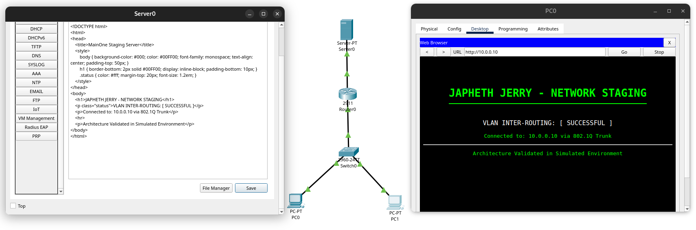
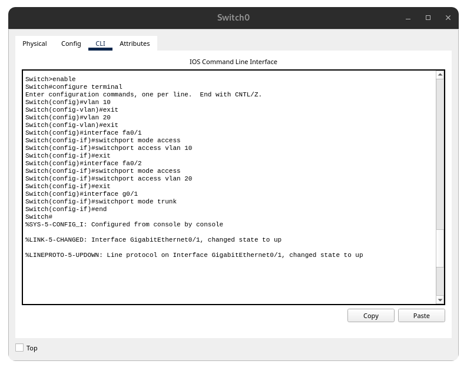
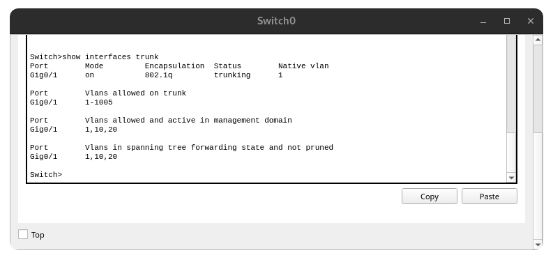
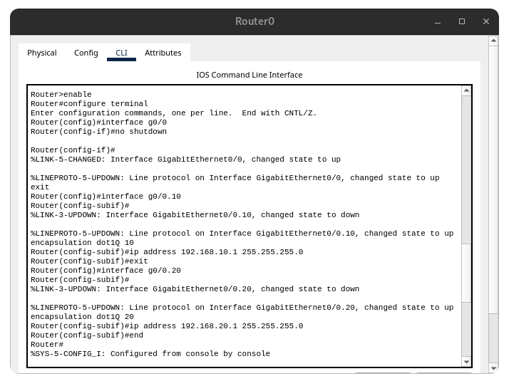
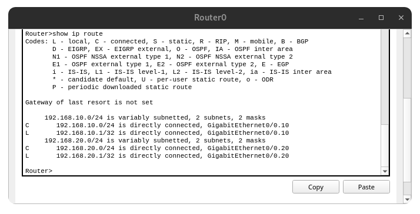
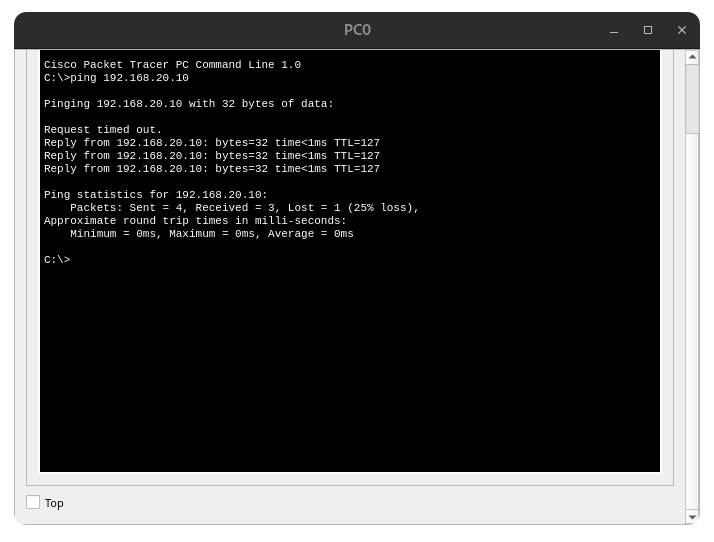
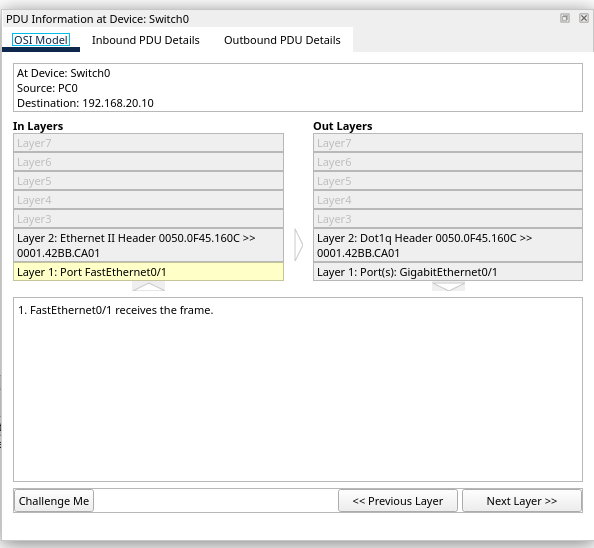

# Pre-Deployment Validation of VLAN Inter-Routing Architecture

This repository contains the source files and technical documentation for the **MainOne Technical Services** network staging project. The goal of this project was to architect and validate a **Router-on-a-Stick (RoAS)** topology to ensure secure inter-VLAN communication before physical deployment.

**Repository Description**: A comprehensive network staging project validating a Router-on-a-Stick (RoAS) architecture with 802.1Q trunking and inter-VLAN routing for MainOne Technical Services.

---

## 1. Project Overview

### Organization
MainOne Technical Services

### Skill Outcome
Mastered VLAN Inter-routing and Router-on-a-Stick (RoAS) configuration by designing, simulating, and validating a functional network architecture in a virtualized staging environment. This involved the architectural design of a segmented network and the configuration of logical subinterfaces on a Cisco 2911 Router using 802.1Q encapsulation to facilitate inter-departmental communication.

---

## 2. Situation Analysis

### Problem Statement
The organization needed a reliable way to test and validate a segmented network architecture to resolve broadcast storms and cross-VLAN interference before committing to a physical hardware deployment.

### Problem Effect
Without a virtual proof of concept, deploying untested routing configurations directly to the live environment risked introducing high latency, misconfigured default gateways, and unacceptable network downtime for end-users, which would severely disrupt business operations.

---

## 3. The Solution & Implementation

### Proposed Solution
I architected a simulated staging environment to build a Router-on-a-Stick topology, successfully configuring logical subinterfaces (G0/0.10 and G0/0.20) and validating seamless routing via an 802.1Q trunk link to ensure all endpoints had fully functional communication paths.

### Implementation Steps

#### A. Physical Topology
The staging environment consists of a 2911 Router connected to a 2960 Switch via a Gigabit link. Two endpoint PCs are assigned to distinct VLANs (VLAN 10 and VLAN 20) to mirror a departmental structure in a virtualized sandbox.



#### B. Layer 2 Switch Configuration
I established the VLAN database and configured the trunking port to allow tagged traffic across the single physical link in the staging setup.

```text
enable
configure terminal
vlan 10
exit
vlan 20
exit
interface fa0/1
  switchport mode access
  switchport access vlan 10
exit
interface fa0/2
  switchport mode access
  switchport access vlan 20
exit
interface g0/1
  switchport mode trunk
end
```




#### C. Layer 3 Router Configuration
I enabled the physical interface and created logical subinterfaces for each VLAN gateway, applying the 802.1Q encapsulation protocol to validate the routing logic.

```text
enable
configure terminal
interface g0/0
  no shutdown
exit
interface g0/0.10
  encapsulation dot1Q 10
  ip address 192.168.10.1 255.255.255.0
exit
interface g0/0.20
  encapsulation dot1Q 20
  ip address 192.168.20.1 255.255.255.0
end
```




#### D. Service Delivery Layer: Web Hosting Integration
To simulate a real-world enterprise environment, I integrated a dedicated web server behind the router on a separate subnet (10.0.0.0/24). I configured the router's G0/1 interface as the gateway and hosted a custom HTML landing page to provide visual confirmation of end-to-end service delivery.


---

## 4. Validation and Technical Verification

### Cross-Network Connectivity Test
I performed an ICMP validation (ping) from PC0 (VLAN 10) to PC1 (VLAN 20). The successful reply confirms that the Router-on-a-Stick setup is correctly forwarding traffic between isolated subnets.



### Deep Packet Inspection (802.1Q Tagging)
Verification was conducted in simulation mode to ensure frame tagging was occurring at the trunk interface. The PDU analysis explicitly shows the 802.1Q header and the VLAN ID (TCI) for the respective departmental traffic.



---

## Repository Structure

*   **`Pre-Deployment_Validation_VLAN_Architecture.pkt`**: The primary Cisco Packet Tracer source file.
*   **`README.md`**: This file, containing the complete Practical Skills Application (PSA) report and project analysis.
*   **`assets/`**: Directory containing screenshots of CLI configurations and topology diagrams.

## Professional Links

*   **Portfolio**: [japhethjerry.space](https://japhethjerry.space)
*   **Contact**: [EMAIL_ADDRESS](princejaphethjj@gmail.com)

---

> Created by **Japheth Jerry** as part of the **Practical Skills Application (PSA)** framework.